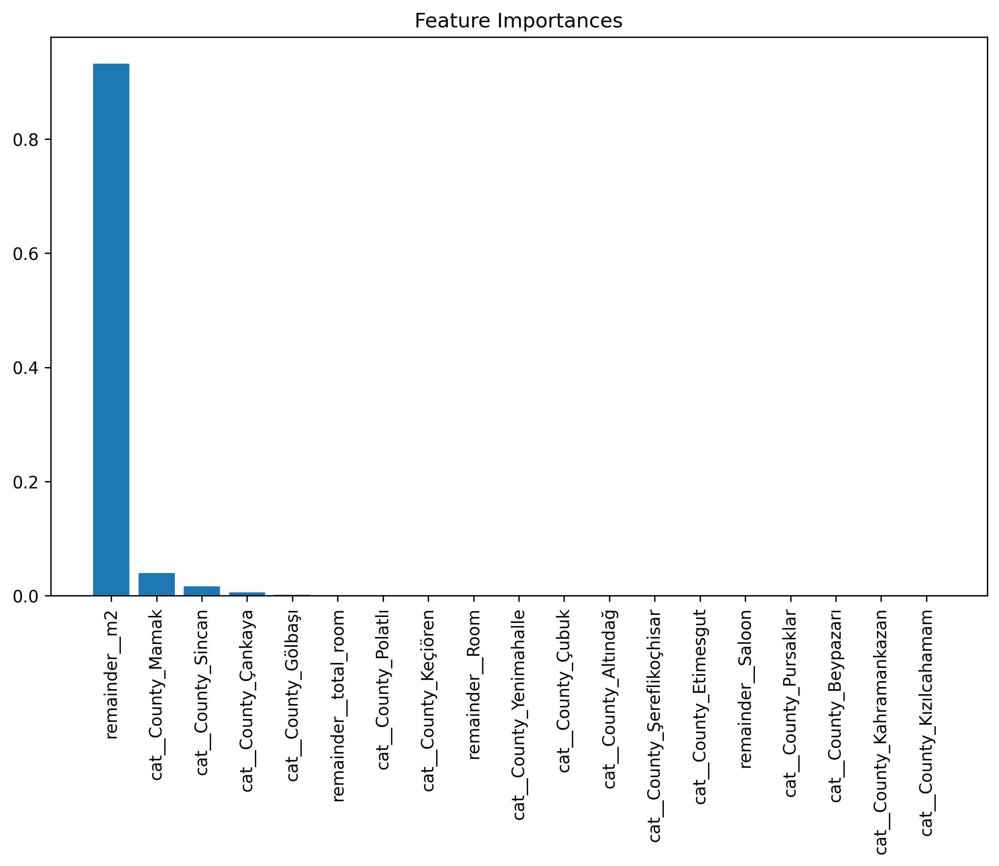

# Ankara Kiralık Konut Fiyat Tahmini

Ankara'daki kiralık konut ilanlarından veri toplayıp, konum ve fiziksel özelliklere
göre kira tahmini yapan uçtan uca bir makine öğrenmesi projesi. Veri toplamadan
web arayüzüne kadar tüm adımlar dahil.

## Pipeline

```
scraping/     ilan verisi toplama
     │
     ▼
notebooks/    keşifsel veri analizi, temizlik, öznitelik mühendisliği
     │
     ▼
src/          model eğitimi + hiperparametre optimizasyonu
     │
     ▼
*.pkl         eğitilmiş scikit-learn pipeline
     │
     ▼
app.py        Streamlit arayüzü
```

## Model

**Algoritma:** GradientBoostingRegressor (hiperparametre optimizasyonu yapılmış)

**Öznitelikler:** İlçe · Metrekare · Oda sayısı · Salon sayısı

Ön işleme adımları (kategorik kodlama, ölçekleme) tek bir scikit-learn
`Pipeline` nesnesinde toplandı; böylece eğitim ve çıkarım arasında dönüşüm
tutarsızlığı riski ortadan kaldırıldı.

### Performans

| Metrik | Değer |
|---|---|
| R² (test) | 0.73215 |
| RMSE | 6763.44772 |

Öznitelik önem sıralaması:



## Kurulum ve çalıştırma

```bash
python3 -m venv venv
source venv/bin/activate        # Windows: venv\Scripts\activate
pip install -r requirements.txt

streamlit run app.py
```

Sol panelden konut özelliklerini girin; tahmini kira ekranda görünür.

## Sınırlamalar

Bu model referans amaçlıdır, ticari kullanıma uygun değildir:

- **Eksik öznitelikler.** Bina yaşı, kat, ısıtma tipi, toplu taşımaya mesafe gibi
  kira üzerinde belirleyici olan değişkenler veri setinde yok. Model bunların
  etkisini metrekare ve ilçe üzerinden dolaylı öğrenmeye çalışıyor.
- **Dengesiz dağılım.** İlçe bazında ilan sayıları eşit değil; az temsil edilen
  ilçelerde tahmin güvenilirliği düşük.
- **Zaman boyutu yok.** Veri tek bir zaman kesitinden toplandı; enflasyon ve
  sezonsallık modellenmedi.

## Geliştirme fikirleri

- Koordinat bazlı özellikler (metro/merkeze mesafe) eklemek
- İlçe yerine mahalle kırılımına inmek
- Tahminlerle birlikte güven aralığı sunmak (quantile regression)
